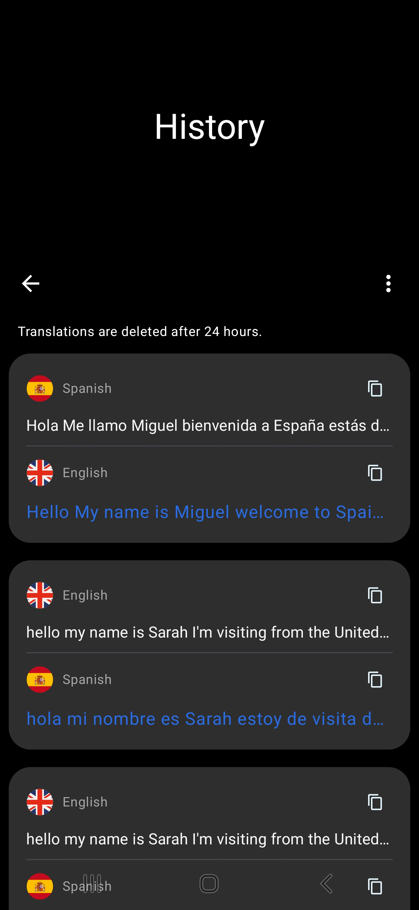
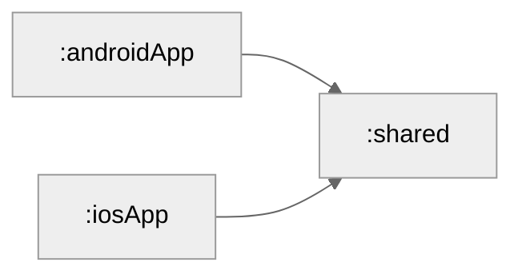

# SunVerta

SunVerta is a comprehensive translation application built with Kotlin Compose Multiplatform (KMP),
offering multiple translation methods:

- Text Translation: Direct text input translation
- Image Translation: Camera-based OCR and translation
- Conversation Translation: Real-time conversation translation

The project utilizes Kotlin Multiplatform to share business logic and data layers across platforms,
while maintaining native UI experiences through Jetpack Compose (Android) and SwiftUI (iOS). This
architecture ensures optimal performance and platform-specific design guidelines on each supported
platform.

## Platforms

|  |  |
|:------------------------------------------------------------------------------------:|:------------------------------------------------------------------------------:|
|                                          ✅                                           |                                Underdevelopment                                |

# Features and Showcase

## Text Translation

## Image Translation

- Camera capture and gallery import
- Text detection and extraction
- Overlay translation on original image

## Conversation Translation

- Two-way conversation support
- Audio input and output
- Transcript history

## Translation History

- Complete translation history
- Quick copy and share options

# Architecture

## Modules

- shared:
    - contains all the shared code between the platforms
- androidApp:
    - contains the android app
- iosApp:
    - contains the ios app

## Core Layers

SunVerta follows Clean Architecture principles with a Multiplatform-first approach, organizing code
into the following layers:

# Built with

- [Kotlin Multiplatform](https://kotlinlang.org/docs/multiplatform.html) - The Kotlin Multiplatform
  technology is designed to simplify the development of cross-platform projects.
- [Jetpack Compose](https://developer.android.com/compose) - The Android’s recommended modern
  toolkit for building native UI. It simplifies and accelerates UI development on Android. Quickly
  bring your app to life with less code, powerful tools, and intuitive Kotlin APIs.
- [Ktor](https://ktor.io/) - Ktor is a framework for building HTTP clients for Kotlin.
- [SQLDelight](https://github.com/cashapp/sqldelight) - SQLDelight is an open-source library
  developed by Cash App (formerly Square, Inc.) for working with SQL databases in Kotlin-based
  Android and multi-platform applications.
- [CameraX](https://developer.android.com/training/camerax) - CameraX is a Jetpack library for
  camera integration in Android apps.
- [MLKit](https://developers.google.com/ml-kit/vision/translate) - MLKit is a library that provides
  machine learning capabilities for translation, object detection, and image classification.
- [Hilt](https://developer.android.com/training/dependency-injection/hilt-android) - Hilt is a
  dependency injection library for Android that reduces the boilerplate of doing manual dependency
  injection in your project
- [Type Safe Compose Navigation](https://www.jetbrains.com/help/kotlin-multiplatform-dev/compose-navigation-routing.html) -
  Type safety in Kotlin DSL and Navigation Compose
- [Kotlinx-serialization](https://github.com/Kotlin/kotlinx.serialization) - Kotlin multiplatform /
  multi-format serialization.
- [Material3](https://m3.material.io/) - Material 3 is the latest version of Google’s open-source
  design system.
- [Kermit](https://github.com/Touchlab/Kermit) - a Kotlin Multiplatform centralized logging utility.
- [CircleCI](https://circleci.com/) - A CI/CD tool that helps automate workflows.
